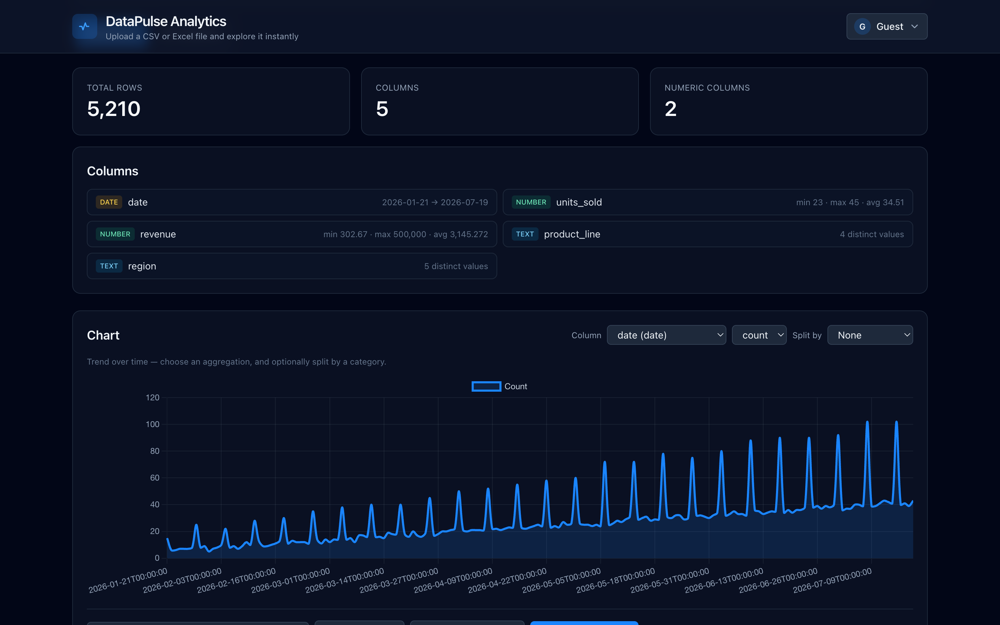
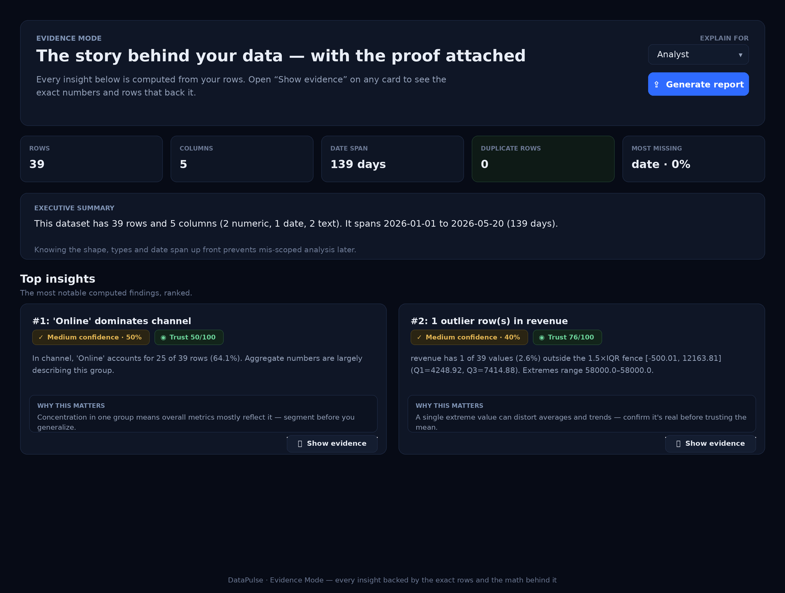

# DataPulse — Backend

Explore any CSV or Excel file instantly. Upload or paste a spreadsheet and get
auto-detected columns, summary stats, a sortable/filterable table, adaptive
charts, and CSV export — no signup. **Live:** https://datapulse-frontend.vercel.app



This repo is the API: **FastAPI + DuckDB**, packaged with Docker. The
[frontend](https://github.com/ankanhq/datapulse-frontend) is a separate React app.

## What's new
- **Evidence Mode** — turn any spreadsheet into a plain-English story with the proof attached.
- **Compare Mode** — compare two slices of your data and see exactly what changed and why.

## What it does

A visitor uploads a CSV/Excel file or pastes spreadsheet text (or pastes a file
straight from the clipboard). The API parses it into an **isolated, in-memory
DuckDB table** and exposes generic endpoints that adapt to whatever columns the
file has:

- **Auto-detected schema** — every column is classified as `number`, `date`, or
  `text`, and the rest of the API adapts to that.
- **Summary stats** — row/column counts plus per-column basics (min/max/avg for
  numbers, range for dates, distinct count for text).
- **Sortable, filterable table** — pagination, sort on any column, and filters
  built per column type.
- **Adaptive charts** — category counts for text columns, a time series for date
  columns, a value histogram for number columns.
- **CSV export** of the current filtered + sorted view.

Nothing is written to disk: an upload is streamed to a temp file, loaded into
DuckDB, and the temp file is deleted immediately. Each dataset is keyed by an
opaque id so one visitor never sees another's data, and datasets are evicted once
the process holds too many or they go stale — which keeps memory bounded on a
free-tier host. Uploads are capped at **25 MB**.

### Evidence Mode
Turns your spreadsheet into a set of plain-English insights — with the proof
attached. Every card is computed straight from your rows (real statistics, no
LLM): an executive summary, the most notable findings ranked, category
concentration, outliers, missing-data checks, correlations, and what changed most
over time. Each insight carries a confidence score and a trust score, and a
**Show evidence** button opens the exact rows and the calculation behind the
claim. Use **Explain for** (Student / Analyst / Founder / Manager / Researcher) to
reword the story, and **Generate report** to create a read-only shareable page.



### Compare Mode
Compare two slices of your data — two date ranges, two filter sets, or a second
uploaded file — and get the delta, % change, top movers, and a plain-English
reason the metric moved.

## Tech stack

- **FastAPI** — HTTP API
- **DuckDB** — in-process analytical engine (one isolated table per upload)
- **pandas + openpyxl/xlrd** — reading the first sheet of Excel files
- **Docker** — deployment image (used on Render)

## Setup

```bash
python -m venv .venv && source .venv/bin/activate
pip install -r requirements.txt
```

### Sample data (optional, for the "Try sample data" button)

The sample endpoint loads a local file pointed to by `DATAPULSE_DATA_FILE`.
Generate one with the included script:

```bash
python generate_data.py --rows 100000 --out data_100k.csv
export DATAPULSE_DATA_FILE=./data_100k.csv
```

The sample is row-capped on load (`DATAPULSE_SAMPLE_ROWS`, default 50,000) so it
stays light. Uploading and pasting work without any local data file.

## Run

```bash
uvicorn main:app --reload
```

Interactive docs at http://localhost:8000/docs

### Docker

The image generates a 100k-row sample at build time, so it's self-contained:

```bash
docker build -t datapulse-api .
docker run --rm -p 8000:8000 -e DATAPULSE_CORS_ORIGINS="http://localhost:5173" datapulse-api
```

## Configuration

All configuration is via environment variables:

| Variable                  | Default                                         | Purpose                                              |
|---------------------------|-------------------------------------------------|------------------------------------------------------|
| `DATAPULSE_CORS_ORIGINS`  | `http://localhost:5173,http://localhost:3000`   | Comma-separated allowed frontend origins.            |
| `DATAPULSE_DATA_FILE`     | `./data_10m.csv`                                | Source file for the sample-data endpoint.            |
| `DATAPULSE_MAX_UPLOAD_MB` | `25`                                            | Per-upload size limit (MB).                          |
| `DATAPULSE_MAX_DATASETS`  | `8`                                             | Max datasets held in memory (LRU-evicted).           |
| `DATAPULSE_DATASET_TTL`   | `1800`                                          | Seconds before an idle dataset is evicted.           |
| `DATAPULSE_SAMPLE_ROWS`   | `50000`                                         | Row cap when loading the sample.                     |
| `PORT`                    | `8000`                                          | Bind port (Render injects this).                     |

## API

All dataset endpoints are scoped to a `dataset_id` returned by one of the three
load endpoints.

| Method | Path                          | Purpose                                                        |
|--------|-------------------------------|----------------------------------------------------------------|
| GET    | `/`                           | Health check (`active_datasets` count).                        |
| POST   | `/datasets`                   | Upload a CSV/TSV or Excel (`.xlsx`/`.xls`) file (multipart).    |
| POST   | `/datasets/text`              | Analyze pasted CSV / tab-separated text (`{ text, name }`).     |
| POST   | `/datasets/sample`            | Load the bundled sample dataset.                               |
| GET    | `/datasets/{id}/summary`      | Row/column counts and per-column stats.                        |
| GET    | `/datasets/{id}/query`        | Paginated, sortable, filterable rows.                          |
| GET    | `/datasets/{id}/export`       | Stream the filtered + sorted view as CSV.                      |
| GET    | `/datasets/{id}/chart`        | Aggregated data for charting (adapts to the column type).      |
| GET    | `/datasets/{id}/insights`     | Computed insight report — accepts `mode` and `filters`.        |
| GET    | `/datasets/{id}/rows`         | The exact supporting rows behind an insight — accepts `rowids`.|
| GET    | `/datasets/{id}/compare`      | Aggregate snapshot used by Compare Mode.                       |
| POST   | `/reports`                    | Save a read-only shared report; returns a token.               |
| GET    | `/reports/{token}`            | Open a previously saved shared report.                         |

The Evidence Mode endpoints:

- `GET /datasets/{id}/insights?mode=&filters=` — computed insight report
- `GET /datasets/{id}/rows?rowids=` — the exact supporting rows behind an insight
- `POST /reports` and `GET /reports/{token}` — save/open a read-only shared report
- `GET /datasets/{id}/compare` — aggregate snapshot used by Compare Mode

All insights are computed with **DuckDB + numpy** — no external AI service, and no
API keys.

Each load endpoint returns `{ dataset_id, name, source, row_count, columns }`,
where `columns` is `[{ name, type, sql_type }]` and `type` is one of
`number` / `date` / `text`.

### Query parameters

`/query` and `/export` accept `sort_by`, `sort_order` (`asc`/`desc`), and
`filters` — a JSON array of `{ col, op, value }`. Allowed operators per column
type: numbers `eq`/`neq`/`gte`/`lte`, dates `gte`/`lte`, text `contains`/`eq`/`neq`.
`/query` also takes `page` and `page_size`.

`/chart` takes `chart_type` (`category_counts` | `time_series` |
`numeric_histogram`), `column`, plus `agg` (`count`/`avg`/`sum`), `y_column`, and
`interval` for time series. The time-series interval is chosen automatically to
keep the number of buckets readable.

### Examples

```bash
# Load the sample, capture its id
DSID=$(curl -s -X POST localhost:8000/datasets/sample | python3 -c "import sys,json;print(json.load(sys.stdin)['dataset_id'])")

curl "localhost:8000/datasets/$DSID/summary"
curl "localhost:8000/datasets/$DSID/query?page=1&page_size=20&sort_by=value&sort_order=desc"
curl "localhost:8000/datasets/$DSID/chart?chart_type=time_series&column=timestamp&agg=avg&y_column=value"
curl "localhost:8000/datasets/$DSID/chart?chart_type=category_counts&column=category"

# Upload your own file
curl -F "file=@mydata.csv" localhost:8000/datasets
```

## Security

Uploaded column names are validated against each dataset's detected schema and
quoted before use, and every user-supplied value is passed as a bound parameter,
so the dynamically-built SQL is not injectable. Excel files are read with pandas
(first sheet only) and converted to CSV, then go through the exact same parsing
path as a normal CSV.

## Deployment

See [DEPLOY.md](DEPLOY.md) for deploying the backend to Render and the frontend
to Vercel.

